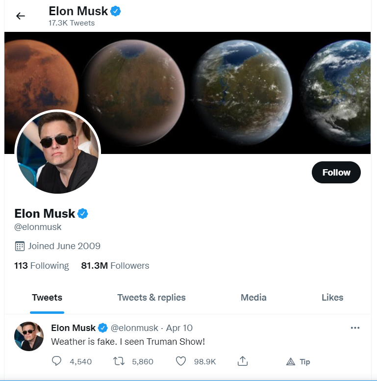
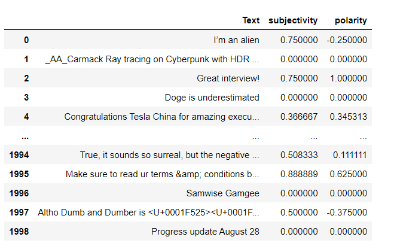
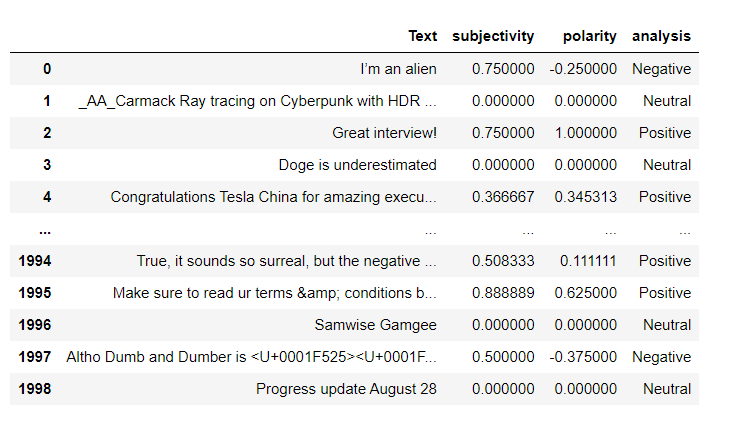
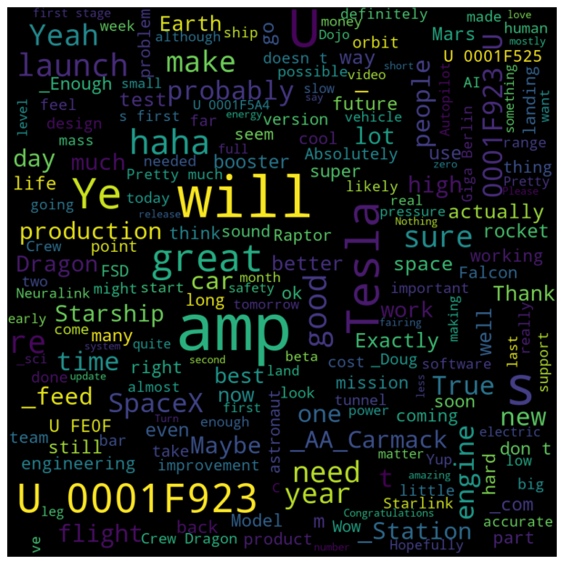
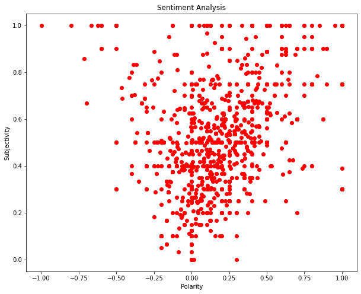

# Elon-Musk-Twitter-Emotion-Mining-Project
emotion mining code on tweets of Elon Musk.
# Emotion Mining 
Emotion mining is the science of detecting, analyzing, and evaluating humans’ feelings towards different events, issues, services, or any other interest. One of its specific directions is text emotion mining, that refers to analyzing people’s emotions based on observations of their writings.

### This small project analyses the tweets of Elon Musk combined together in a dataset using technologies like re, matplotlib, pandas and textblob. 

One of the objects of the project is cleaning the tweet data and removing all the @ mentions and # 
Then we Perform sentiment analysis on the data by using textblob, finding out the polarity and subjectivity of the tweets. 

Then we use the polarity score of the tweets and divide them into positive, neutral and negative performing an emotion mining based on the polarity of the tweet. 

## Elon Musk Tweets Word CLoud 

## Emotion mining scatter plot

